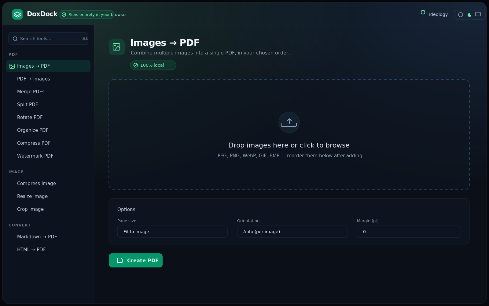

# DoxDock

**Offline-first document & image tools that run 100% in your browser. Nothing you open ever leaves your machine.**

DoxDock is a collection of ~20 everyday PDF and image utilities — merge, split, compress, convert, watermark, extract text, and more — built on one hard rule: **your files never get uploaded anywhere.** Every operation runs client-side, on your device, using your browser's own CPU. No servers, no accounts, no analytics, no network.

It exists for the moment you have a sensitive PDF — a contract, a payslip, a medical scan — and just need to _do one thing_ to it without handing it to a random online converter. Read the [ideology letter](public/ideology.html) for the why.

> **Runs entirely in your browser — no uploads, no network.**



---

## Why it's "provably local" — and how to verify

Most "free online PDF tools" upload your file to a server you know nothing about. DoxDock is the opposite, and it's built so you don't have to take our word for it:

1. **A strict Content-Security-Policy forbids network access.** `index.html` ships a CSP with `connect-src 'self'` — the browser will _refuse_ any outbound `fetch`/`XHR`/`WebSocket` to any host but its own origin. If a future change tried to phone home, the browser would block it.
2. **Everything is bundled locally.** Fonts (system stack), icons (inline SVG), the pdf.js worker, and all WebAssembly are served from the app itself. There are no CDN links, no external fonts, no trackers.
3. **It's an installable PWA that works offline.** After the first load, a service worker caches everything. Pull your network cable / turn off Wi-Fi — every tool still works.

### Verify it yourself (30 seconds)

- Open DevTools → **Network** tab, then use any tool. You'll see requests only to your own origin (in dev, `localhost`) — never an external domain.
- Or: load the app once, go **fully offline** (airplane mode / disconnect), and reload. Everything keeps working.
- Or: read the source. It's MIT-licensed and small. `connect-src 'self'` is in [`index.html`](index.html); the pdf.js worker is bundled in [`src/lib/pdfjs.js`](src/lib/pdfjs.js).

We persist only **non-sensitive UI state** (your theme and last-used tool) in `localStorage`. File contents are never written to storage and never transmitted.

---

## Quick start

```bash
# install
npm install

# dev server (http://localhost:5173)
npm run dev

# production build -> dist/
npm run build

# preview the production build
npm run preview
```

Requirements: Node 18+. No backend, no environment variables, no services to run — it's a static site.

### Verify the offline build

```bash
npm run build
npm run preview
# open the URL, then disconnect your network and use the app.
# In DevTools → Network, confirm zero requests leave your origin.
```

---

## Supported operations

Operations whose client-side result has inherent limits are labelled honestly in the UI **and** here.

### PDF

| Tool | What it does | Caveats |
|---|---|---|
| Images → PDF | Combine images into one PDF, ordered, with page-size/orientation options | — |
| PDF → Images | Export each page as PNG or JPEG (ZIP download) | — |
| Merge PDFs | Combine multiple PDFs, drag to reorder | Encrypted PDFs unsupported |
| Split PDF | Extract page ranges or explode into single pages | Encrypted PDFs unsupported |
| Rotate PDF | Rotate all or selected pages by 90/180/270° | — |
| Organize PDF | Reorder / delete pages via thumbnails | — |
| Compress PDF | Re-encode page images + strip metadata; before/after size | **Results vary.** "Re-encode pages" rasterizes (text becomes non-selectable); text-only PDFs barely compress — use "strip metadata" for those. |
| Watermark PDF | Text stamp, centered or tiled, with opacity/angle | — |
| Add Page Numbers | Stamp page numbers with position/format options | — |
| Extract Text | Output plain text or Markdown | Text-based PDFs only; **no OCR** for scans |
| PDF → Word | Extract text into an editable `.docx` | **Text only** — complex layout, tables, and images are not preserved; no OCR |
| Word → PDF | Convert `.docx` to PDF | **Approximate layout** — headings/lists/bold kept; exact fonts, images, columns, tables not reproduced |
| Fill PDF Form | Fill AcroForm fields and optionally flatten | Only PDFs with real form fields |

### Image

| Tool | What it does | Caveats |
|---|---|---|
| Compress Image | Quality slider, before/after size | PNG is lossless — convert to JPEG/WebP for big savings |
| Resize Image | By dimensions or percentage, keep aspect ratio | — |
| Convert Image Format | PNG ↔ JPEG ↔ WebP | — |
| Crop Image | Interactive drag-to-crop | — |
| Strip Image Metadata | Remove EXIF/GPS by re-encoding | — |
| Rotate / Flip Image | 90° steps + horizontal/vertical flip | — |

### Convert

| Tool | What it does | Caveats |
|---|---|---|
| Markdown → PDF | Render Markdown text or `.md` file to PDF | Common Markdown subset |
| HTML → PDF | Render HTML markup or `.html` file to PDF | **Approximate layout** — CSS/images not reproduced |

---

## Tech stack

- **React + plain JavaScript (JSX)** + **Vite**
- **Tailwind CSS** (the "Aurora" theme — deep slate with a mint→sky glow, light + dark)
- **vite-plugin-pwa** for the offline/installable service worker
- Client-side libraries, all bundled locally (no CDN): `pdf-lib`, `pdfjs-dist` (worker bundled), `jspdf`, `docx`, `mammoth`, `browser-image-compression`, `fflate` (zip). Plus the browser **Canvas** and **Web Crypto** APIs.

No dependency makes network calls at runtime. Heavy work (pdf.js rendering, image compression) runs in web workers to keep the UI responsive.

## Architecture

DoxDock uses a **plugin/registry** architecture. Each operation is a self-contained folder under `src/operations/<id>/` with metadata, a component, and pure helpers. A central registry auto-discovers them via `import.meta.glob` and lists them in a searchable, categorized sidebar with a Cmd/Ctrl+K command palette. Adding a tool = drop in one folder. See [CONTRIBUTING.md](CONTRIBUTING.md).

## Contributing

PRs welcome — especially new operations. See [CONTRIBUTING.md](CONTRIBUTING.md) for a step-by-step guide. The one rule that can never break: **no runtime network requests.**

## License

[MIT](LICENSE) © 2026 Mithun Srinivas
